# MII
## 1.1. MII (IEEE 802.3, clause 22)
Media Independent Interface (MII) 接口是 10M/100M 以太网用于 MAC-PHY 相连接的接口。为了提高芯片兼容性，使一个芯片能够支持多种网络介质对外传输，10M/100M 以太网通常设计为 soc 内置 mac 而外置 phy 的方案。MAC 负责与 APB/AXI 总线连接，并转换为 MII 信号对外输出。PHY 则负责将 MII 信号转换为 RJ45 或者 XFI 等与介质相关的物理信号，从而实现在不同介质上对外通信。
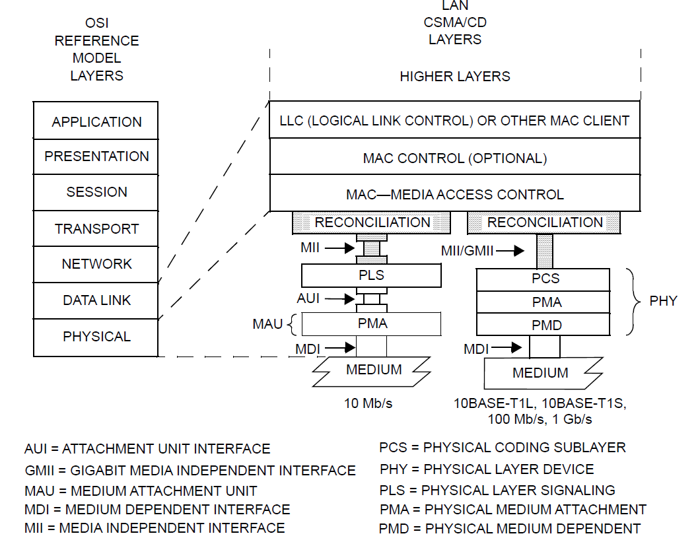

MII 总线设计为支持如下场景：
- chip-to-chip connection on printed circuit board.
- motherboard-to-daughterboard connection.
- 板间互联.

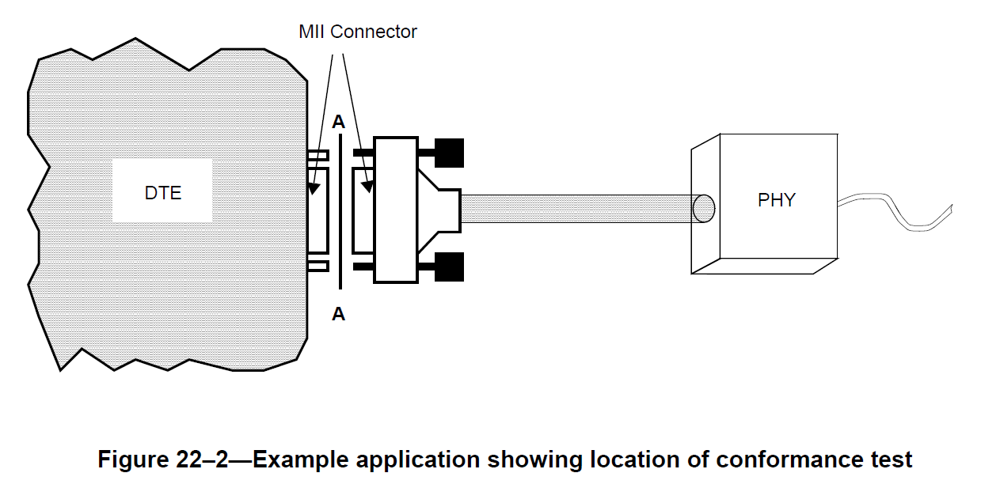

MII 接线结构如下：
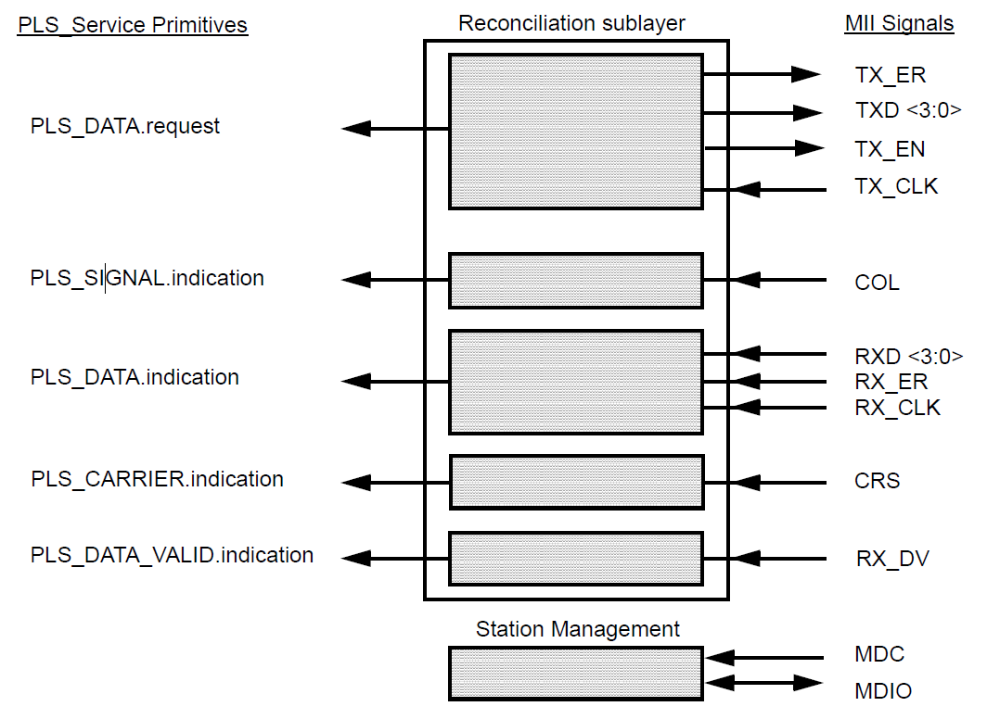

- T/RXD <3:0>: 通过 4 bit TXD 与 4 bit RXD 进行通信。
- T/RX_CLK: 由 phy 分别提供通信时钟，四路数据在 CLK 上升沿采样。CLK 频率为目标速率的 1/4，例如对于 100Mbps 通信场景，CLK 需要达到 25M。
- TX_EN/RX_DV: 指示当前链路上是否有数据传输。
- CRS: 指示 idle 状态，当存在 TX/RX 时拉高。
- T/RX_ERR: 指示数据错误。
- COL: 冲突检测。
- MDIO/MDC: 按照 clause 22/45 在 mac 与 phy 之间传递控制信息，MDC 为 MDIO 的采样时钟。

## 1.4. MDIO (IEE 802.3, clause 22&45)

由于 soc 与 phy 无法直接通过 apb 总线访问后者内部寄存器，因此需要在 MII 总线上适配控制信号以使 cpu 具备操作 phy 寄存器的能力，以完成 phy 初始化等流程。MII 总线定义了独立的两根线以在 mac-phy 之间传递控制信号和状态信息：

1. Manage Data Clock (MDC, pin3), 作为 MDIO 接口的时钟输入，由 mac 提供，最小周期为 400ns.
2. Manage Data Input/Output (MDIO, pin2), 控制信号与状态传递。其中控制信息由 mac 一侧驱动，phy 采样，状态信息则相反。

### MII stream flow

MII 总线传输协议定义为如下结构:

```
<inter-frame> + <preamble> + <sfd> + <data> + <efd>
```

由于 MII 是一个 4bit 传输协议，因此每一个 8bit octal 会被拆分成两个 4bit nibble，从而将串行数据拆分成 4 路并行数据传输。
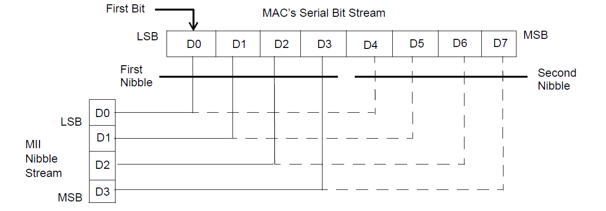

inter-frame 为两个 packet 的间隙窗口，通常为高电平状态。
preamble 作为数据先导为一连串的高低电平变换，以用于双方同步:
```
10101010 10101010 10101010 10101010 10101010 10101010 10101010
```
SFD (Start Frame Delimiter) 指示数据正式开始，结构为:
```
10101011
```
preamble + SFD 共同构成了 MII packet header, TX 一侧主动拉高 TX_EN 并发送上述数据，从而由 RX 一侧感知数据来临:

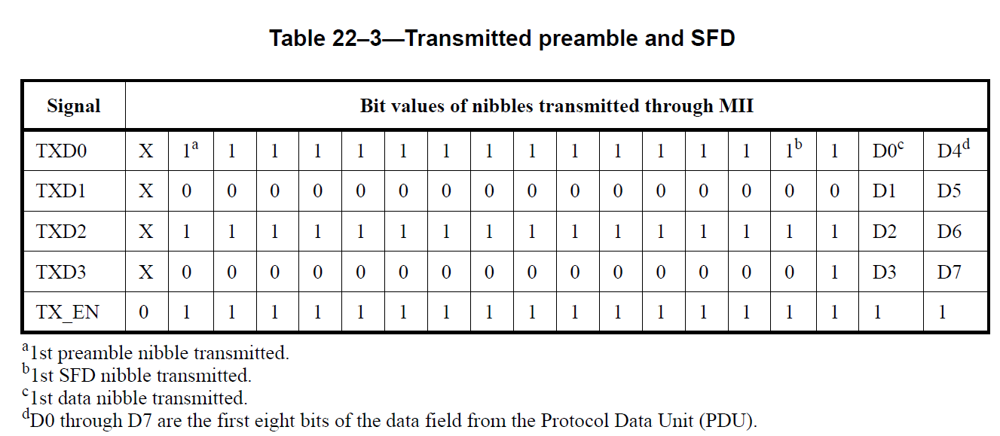

EFD（End-of-Frame delimiter）则对应 TX_EN 拉低，随后数据传输结束。

## 1.2. GMII (IEEE 802.3, clause 35)

GMII 接口从 MII 接口发展而来。其数据线 TXD/RXD 扩展为 7bit 并行数据, 由 mac 一侧生成 125M GTX_CLK，8 路并行数据在上升沿采样从而实现 1000Mbps 速率。

> - MII 接口的采用公共时钟方案， TX_CLK/RX_CLK 均由 phy 一侧提供公共时钟，以降低 phy 内部的时钟同步需求。
> - GMII 接口采用源时钟方案，GTX_CLK 由 mac 一侧提供，而 RX_CLK 则由 phy 提供。通过发送源自行提供时钟来避免在如此高频场景下出现采样错误。

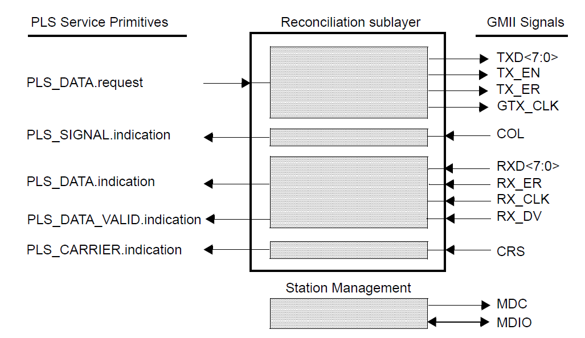

### 扩展: Carrier Extend
CSMA/CD 机制要求了最小帧长要求，以确保发送方完成发送完成之前，网络的最远端具备监测冲突的能力。
10M/100M 以太网中将最小帧长定义为 512bits，100Mbps 速率下最远传输距离约为 1km。然而 512bit 在 1000Mbps 的速率下，发送完成前只有 100m 传输距离，无法满足需求，因此将载波信号在介质上的持续时间延长至 512Bytes (4096bits) 以满足冲突检测窗口要求。

802.3帧格式(mac 协议)规定的最下数据包为 64字节。在 10M/100M 以太网中满足 CSMA/CD 最小帧长要求, 然而在 1000M 以太网下则不再满足需求。为了满足冲突检测需求，因此 GMII 数据会在数据包不足 512Bytes 时通过引入载波扩展来满足 4096bits 需求。具体做法为：在正常数据传输完成后，TX_EN 拉低，TX_ERR 拉高，同时 TXD 传递 0x0F 作为 CE 信息。

备注: 不同速率下最小帧长传输时间内能达到的最远距离 (假设光纤折射率=1.5):
- 100Mbps 下 512bit 传递距离: `(3e11 /1.5) * (512/1e8) = 1024m`
- 1000Mbps 下 4096bit 传递距离: `(3e11 /1.5) * (4096/1e9)=819.2m`

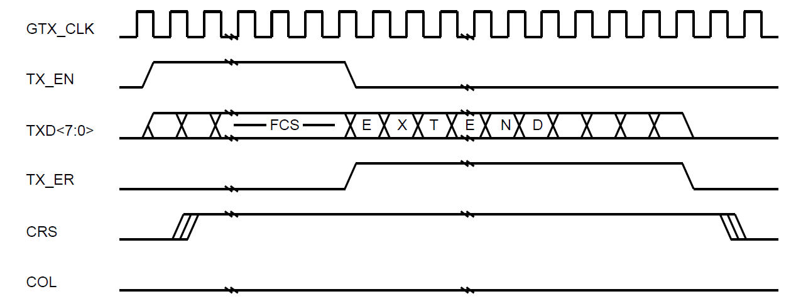
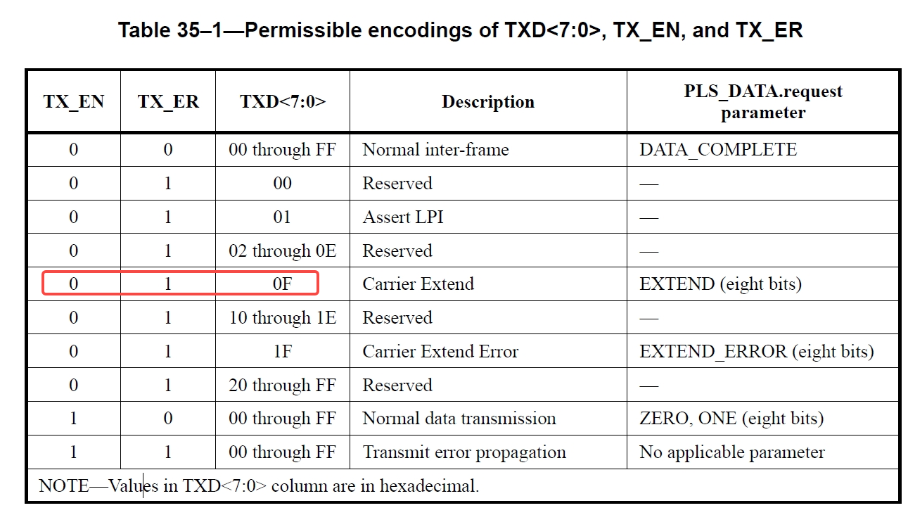

### 扩展: LPI

clause 35 定义了 GMII 的 low-power mode 协议格式。配置 TX_EN=0, TX_ERR=1 的情况下，连续 9 个时钟周期发送 TXD=0x01 后即可关闭自身 GTX_CLK 进入 low-power mode。 
在 GTX_CLK 关闭期间强制要求 TXD=0x01 且 TX_ER 拉高。
退出 LPI 的方式为 GTX_CLK 重新使能后 TX_ER 拉低。

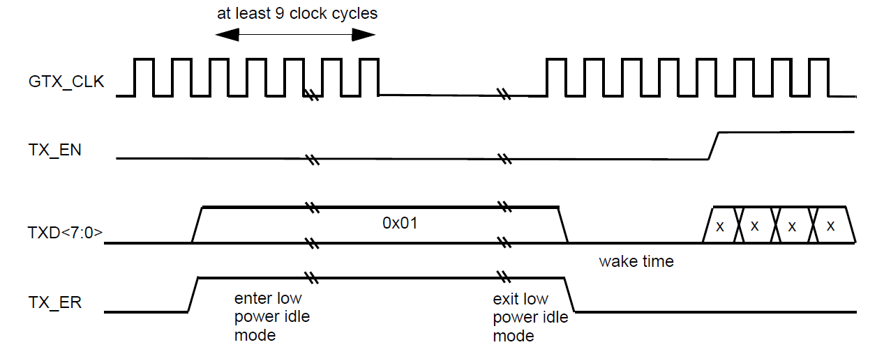

### 扩展: Signal mapping

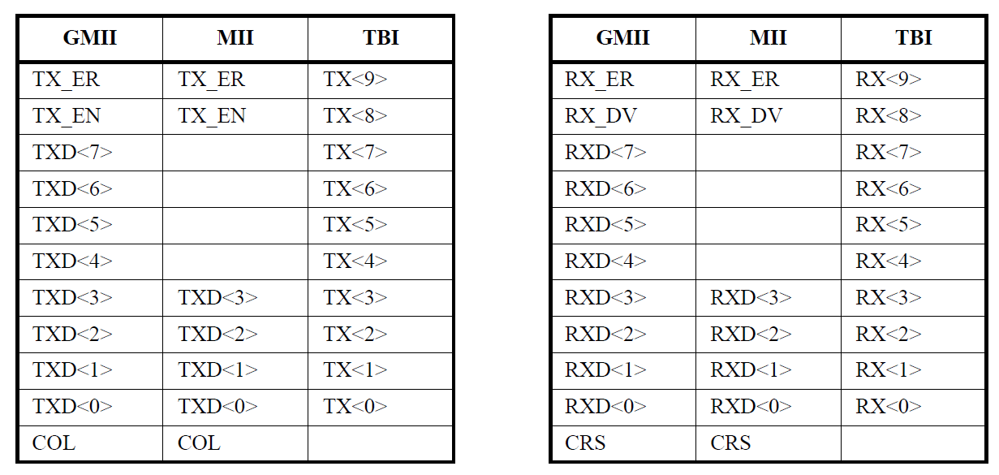

## 1.3. XGMII (IEE 802.3, clause 46)

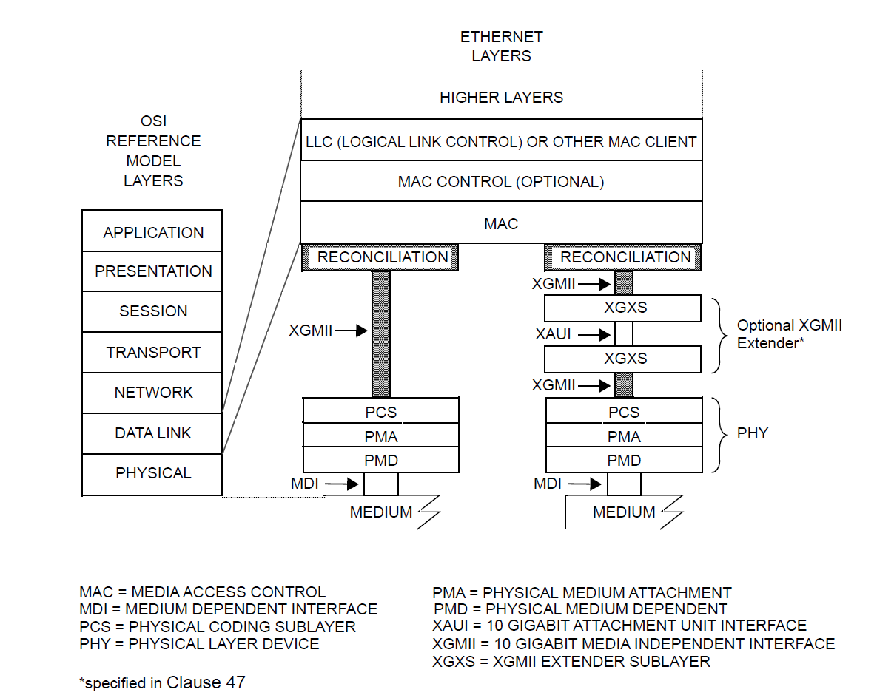
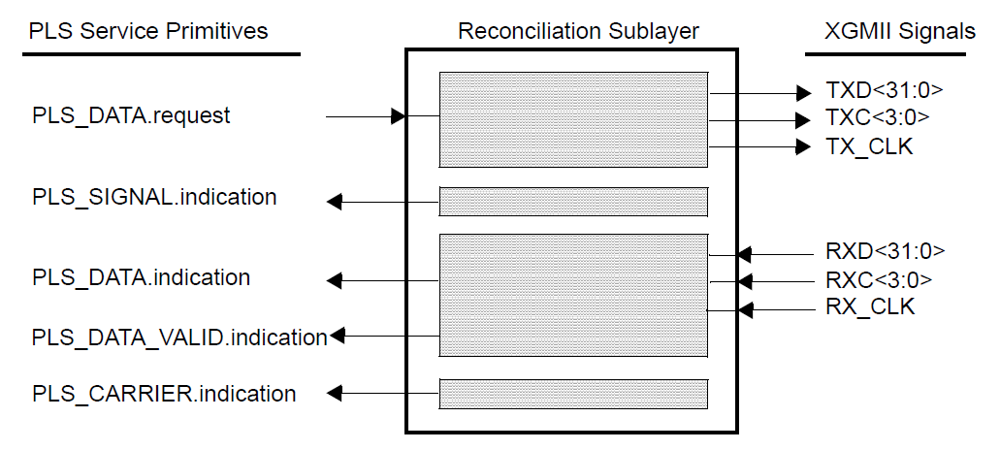

```
156.25Mhz * 2 * 32bit = 10000Mbps
```

XGMII TX/RX 方向各自有独立的 32bit 数据线 (T/RXD) 与 4bit 控制线 (T/RXC)。数据按照 DDR 模式分别在 TX_CLK 上升沿与下降沿采样，T/RX_CLK 频率为 156.25MHz 从而实现 10Gbps 速率。

XGMII 在实际传输时拆分成 4 lane 分别进行传输，每路由独立的控制信号 TXC，且支持动态裁剪以适配 5G/2.5G 速率：
- Lane x4: 10G
- Lane x2: 5G
- Lane x1: 2.5G


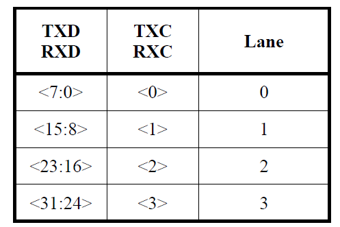
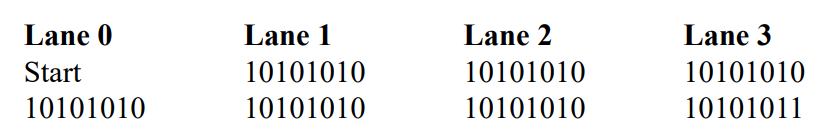

XGMII 要求数据为 8bit 对齐。preamble+sfd 与 MII 格式一致。经过两个时钟周期的先导后即开始发送数据。preamble 的第一个 8bit 数据被编码为特殊的 Start pattern (TXC0=1, TXD=0xFB)，从而利用 TXC 的脉冲信号指示开始，并在结束处构建 Terminate pattern (TXCx=1, TXD=0xFD) 指示数据结束。

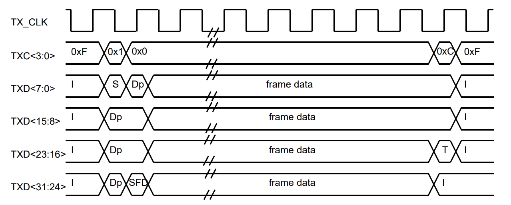
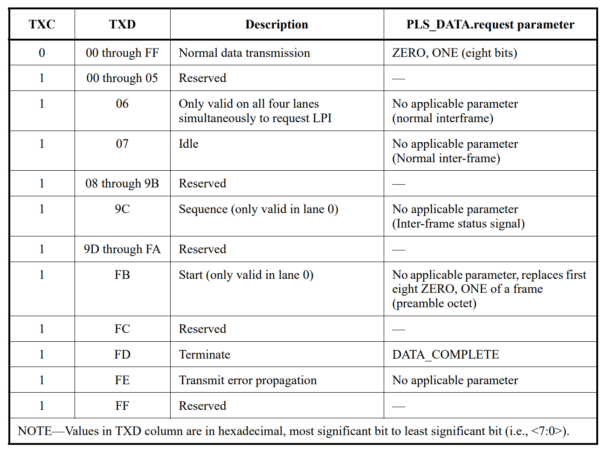

Reconciliation sublayer 需要将 MAC 数据匹配为 XGMII 所需的数据格式。一个重要的要求控制 inter-frame 的时长，从而实现 preamble TXC0 对齐。
