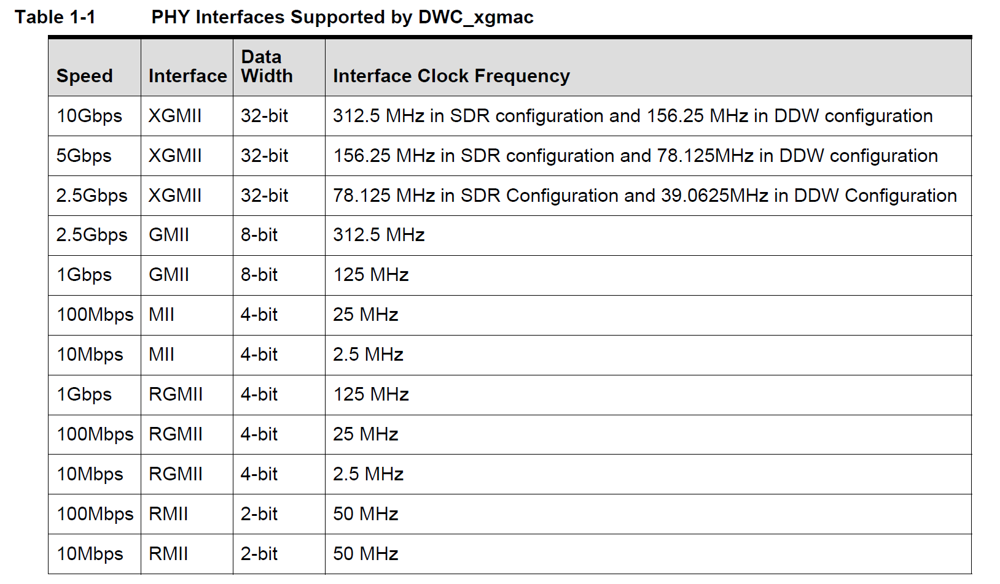
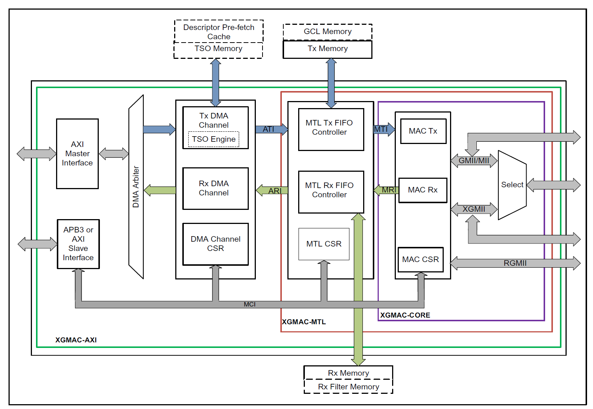

XGMAC 按照功能划分，从内到外有三个功能区：
- DMA: 处理由 CPU 操作的 desc 以及 tx/rx buffer prefetch，在发送一侧识别 DESC_OWN 字符并将描述符指示的数据传递至 MTL。RX 一侧将 MTL 传递的数据拷贝至 CPU 提供的 buffer 里并上报 DESC_OWN。
- MTL: 数据中转，将数据中转并分流成多个 queue。在 TX 一侧插入 VLAN tag 或者处理 TSO feature。RX 一侧对数据进行校验，上报正确数据包，舍弃异常数据包。
- MAC: 将 MTL 上报的 packet 转换成 MII/GMII/XGMII interface 并向外传输，遵循 MII 协议规范生成 preamble，SFD 等标志。

MAC 层做分层：
- Transmit Bus Interface Module (TBU)
	通过内部 64/128 bit 数据输入转换成内部信号，并对数据包进行定制 vlan tag & mac address，并将修正好的数据传递给 TFC
- Transmit Frame Controller Module (TFC)
	为数据添加 CRC 以及 pad bytes (以满足最小 64 bytes 数据需求)
- Transmit Protocol Engine Module (TPE)
	基于下游协议 (MII/GMII/XGMII) 进行适配 preamble, jam pattern 等，最终转换成 MII 协议信号对外发送。
	- XGMII: 生成SCC (8'b11011111) + preamble (8'b10101010 * 7Bytes) + SFD (8b'10101011) 并同步生成 TXC 脉冲。
	- GMII: 生成 preamble/SFD 并处理 TX_EN 与 TX_ER。
- Transmit Scheduler Module (STX)
	- 发包调度：在两笔包之间添加 inter-frame gap
	- 适配 SONET/SDH 降速需求。
- Transmit XGMII Interface FIFO (TIF)
	- 适配不同 XGMII 传递方式： SDR (312.5MHz) or DDR/DDW (156.25MHz)

